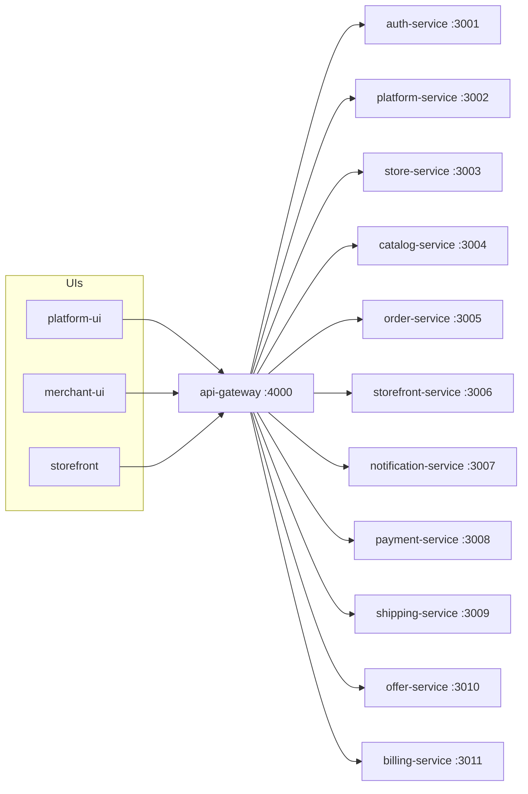
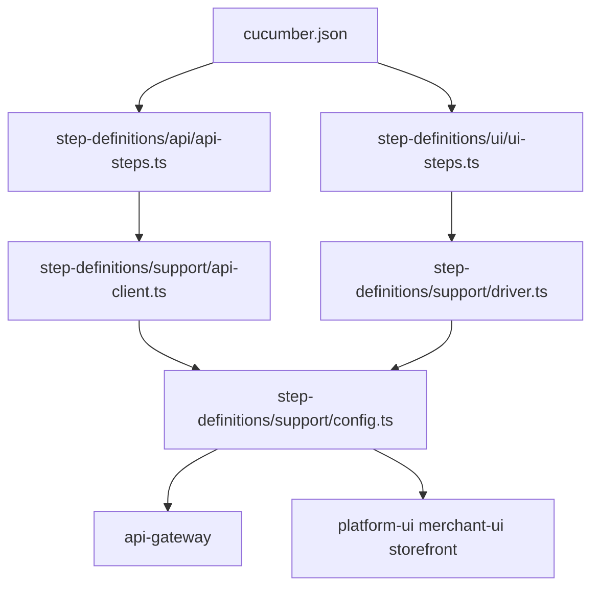

# Knowledge graph — e2e-tests

## This repo

## Task → file

- New API assertion: `step-definitions/api/api-steps.ts` + `api-client.ts`.
- New UI flow: `step-definitions/ui/ui-steps.ts` plus feature files if present.
- Wrong environment: `step-definitions/support/config.ts`.
